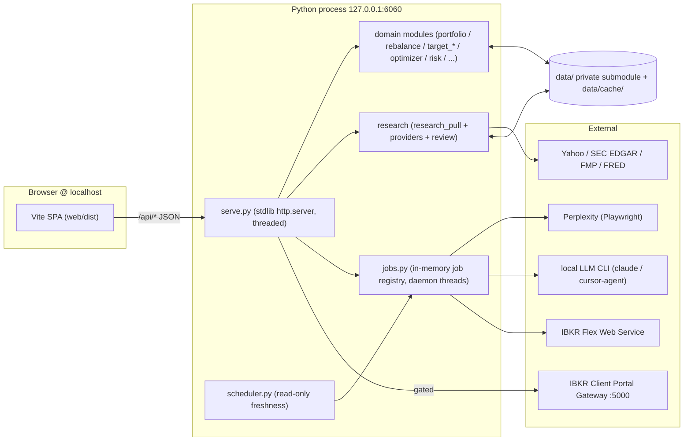
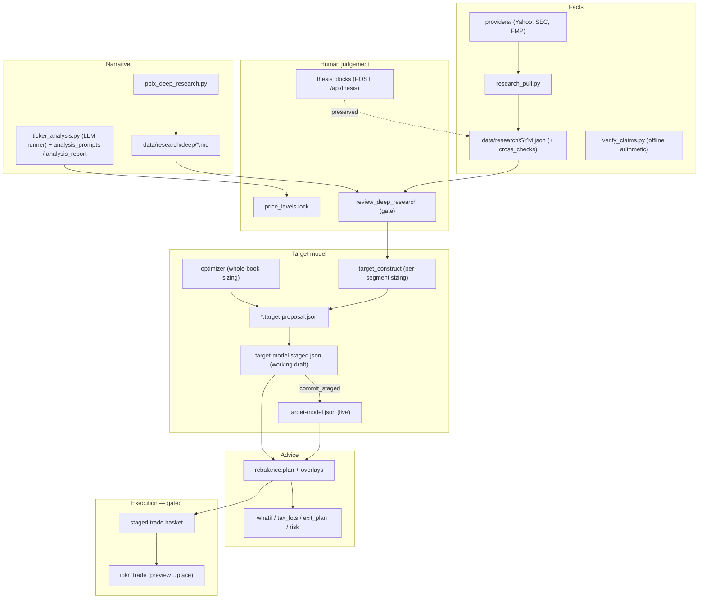

# Assay — Architecture

A reference for how Assay is built and why. It complements the other docs rather
than repeating them:

- **`README.md`** — what the app is for, how to run and configure it (user-facing).
- **`docs/FEATURES.md`** — the feature catalog: every view, button, and the API
  endpoints each one calls (user-facing surface, traced to handlers).
- **`ORIENTATION.md`** — "what lives where" + the operator workflows (refresh,
  research, trade). *Note: parts of its nav vocabulary predate the current UI
  (see [§9](#9-known-documentation-debt)).*
- **`tools/README.md`** — per-module CLI notes and the Deep Research setup.
- **This file** — the internal design: layers, data flow, the request lifecycle,
  the domain model, and the invariants that keep it honest.

Audience: a future maintainer (human or agent) who needs the mental model before
touching code.

---

## 1. Purpose in one paragraph

Assay is a **single-user, local-first portfolio research and rebalancing
workbench**. Its thesis is in the name: *test every number before you trust it.*
It pulls market data from multiple sources, cross-checks them for internal
consistency, keeps fetched **facts** strictly separate from human **judgement**,
turns a target allocation model into drift-and-rebalance advice, and — only
through one deliberately gated, paper-first surface — can place orders. It is
**not** multi-user, hosted, or a robo-advisor. The research and rebalancing
halves never trade; the opt-in **Trade desk** is the sole order-placing path.

**Non-goals:** no auto-trading, no cloud/multi-tenant, no order generation from
the research side, no live market watching (locked price levels are
human-confirmed limit triggers, never standing orders).

---

## 2. The big picture

Assay runs as **two local processes** (plus one external gateway for trading):



Design stance, deliberately conservative:

- **Backend is Python standard library only.** `serve.py` is a threaded
  `http.server`; there is no web framework, no ORM, no message queue. The only
  heavy dependency (Playwright) is optional and lazy-imported inside a job thread.
- **State is files, not a database.** Everything is JSON/Markdown under `data/`
  (private submodule) and `data/cache/` (gitignored, regenerable).
- **The frontend is a hand-rolled TypeScript SPA** built by Vite — no UI
  framework. It talks to the API via one `fetch` helper.
- **Facts and judgement are physically separated** and never overwrite each other.

---

## 3. Repository layout

| Path | What |
| --- | --- |
| `tools/` | The Python backend: HTTP server, domain logic, research, providers, jobs, IBKR. ~50 modules, stdlib-only. |
| `tools/providers/` | Data-source adapters: `yahoo`, `sec_edgar`, `fmp`, `fred`, `common`. |
| `tools/tests/` | `unittest` suite (offline, ~1s). |
| `tools/hooks/pre-commit` | Blocks committing holdings figures / secrets into the public repo. |
| `web/` | The SPA. `web/src/*.ts` (views + shell + core), `web/index.html`, `web/style.css`, `web/dist/` (build output). |
| `web/tests/` | Vitest unit/DOM tests. |
| `e2e/` | Playwright end-to-end specs (hermetic; `/api/**` mocked). |
| `site/` | A separate static marketing/landing page (not the app). |
| `data/` | **Private git submodule**: holdings, target model, research, segments, journal. Never in the public repo. |
| `README.md`, `ORIENTATION.md`, `ARCHITECTURE.md`, `tools/README.md` | Docs. |
| `vite.config.ts`, `tsconfig.json`, `eslint.config.js`, `vitest.config.ts`, `playwright.config.ts`, `mypy.ini`, `package.json` | Toolchain. |
| `.github/workflows/tests.yml` | CI (see [§10](#10-testing--ci)). |

---

## 4. Backend: server, routing, jobs

### 4.1 HTTP server and request lifecycle

`tools/serve.py` runs a `ThreadingHTTPServer` bound to **`127.0.0.1:6060`**
(loopback only; non-loopback hosts are refused). One thread per request.

Routing is four dicts mapping path → handler-method name: `_GET_EXACT`,
`_GET_PREFIX`, `_POST_EXACT`, `_POST_PREFIX`. Resolution is exact-match first,
then longest matching prefix. Everything not under `/api/` is served as a static
file.

```
Client
  → ThreadingHTTPServer (127.0.0.1:6060)
    → do_GET / do_POST
      → route lookup (exact, then longest prefix)
        → _dispatch(handler)  →  getattr(self, name)(...)
          → domain/research/service module
          → _send_json(payload)         (Cache-Control: no-store)
      OR _serve_static(rel)             (web/dist if built, else raw web/)
```

- **Bodies:** `_read_body()` enforces `Content-Length`, a 5 MiB cap, and
  JSON-object parsing; malformed → 400.
- **Errors:** a small vocabulary in `tools/apierror.py` (`HttpError` 500,
  `BadRequest` 400, `Forbidden` 403, `Conflict` 409, `BadGateway` 502). `_dispatch`
  maps these + `ValueError` (400) + `ProviderError` (502) to `{"error": msg}`.
  Truly unexpected exceptions log to `tools/errorlog.py` (`data/error_log.jsonl`)
  and return 500.
- **SPA serving:** prefers `web/dist/index.html` (the Vite build); falls back to
  raw `web/` (only fully works with the Vite dev server). Startup warns if
  `web/dist` is missing.
- **Secrets bootstrap:** `secrets.env` (repo root) and `tools/secrets.env` are
  read into the environment at boot via `setdefault`.

### 4.2 Configuration (`tools/config.py`)

Resolution order for any key: **`os.environ` → `tools/secrets.env` → default**
(`config_value` / `flag_enabled`). Canonical paths (`DATA_DIR`, `RESEARCH_DIR`,
`HOLDINGS_JSON`, `TARGET_MODEL_JSON`, `DEEP_DIR`, `ANALYSIS_DIR`,
`SEGMENT_DEF_DIR`, `SEGMENT_OUT_DIR`, …) all live here. Notable env knobs:
`SEC_USER_AGENT`, `FMP_API_KEY`, the `IBKR_*` trading flags, `ASSAY_AUTO_*` /
  `ASSAY_ORDER_WATCH` / `ASSAY_TAX_ALERTS` / `ASSAY_JOURNAL_SCORE` scheduler flags, `ASSAY_NOTIFY*` (notification channel),
`PPLX_*` automation settings, `REBAL_CLAUDE_CLI` / `REBAL_CURSOR_CLI`.

### 4.3 The job / task system

Long or blocking work (browser automation, LLM calls, IBKR pulls, segment
refreshes) runs as background jobs so the synchronous server stays responsive
and work survives navigation.

- **`tools/jobs.py`** — an in-memory registry (`_JOBS`, lock-guarded, **lost on
  restart**). `spawn(kind, target, …)` runs `target` on a daemon thread; states
  are `queued/running/done/error/cancelled/needs_login`. Cancellation is
  cooperative (workers poll `is_cancelled`). Browser jobs claim a limited number
  of concurrency slots (`PPLX_MAX_CONCURRENT`, default 3).
- **`tools/browser_jobs.py`** — Perplexity Playwright automation (deep research,
  login, URL import). Claims a browser slot; writes artifacts under `DEEP_DIR`.
- **`tools/analysis_jobs.py`** — local LLM CLI work (per-ticker analysis,
  whole-book portfolio review, ticker/report Q&A). No browser slots; portfolio
  review fans out over a thread pool.
- **`tools/holdings_sync.py`** — IBKR sync / history / sectors jobs.
- **`tools/scheduler.py`** — an **opt-in, read-only** freshness daemon
  (`ASSAY_AUTO_REFRESH=1`). It reuses the same button-equivalent jobs on a timer:
  holdings resync (stale > N days), history top-up (which also tops up the daily
  FX panel — see `fx_history.py`), stale segment refresh, a market-hours gate-quote
  sweep, **journal outcome scoring** (stamps 30/90/365-day outcomes on directional
  decisions from historical closes — `journal.score_outcomes`, so `calibrate` stops
  starving on manual outcomes and stops scoring old buys against today's bull-market
  mark), and (default-off, opt-in via `ASSAY_ORDER_WATCH`)
  an **order/fill watcher**. It **never** trades, calls an LLM, runs Perplexity,
  or writes the target model. Each task is a pure `should_run(last_run, obs)`
  predicate plus an action that dispatches through `jobs.spawn`; `tick()` is fully
  injectable for tests.
- **`tools/order_watch.py`** — the event loop the connector was missing. Inside
  the market window it polls the state of orders **the human already placed**
  (`ibkr_trade.live_orders`) and detects transitions — filled / partial / cancelled
  / rejected. On a fill it kicks the holdings-resync job (so the planner stops
  advising off a pre-fill book — there is no plan/overview cache; everything reads
  the snapshot from disk), records the fill, and emits a notification. If the
  gateway session drops while orders are working it alerts once. It is strictly
  read-only w.r.t. the market: it never places, modifies, or cancels an order. The
  transition logic is pure/unit-tested; the IBKR IO sits behind injectable seams.
  `poll_once(dry_run=True)` (also `python tools/order_watch.py`) exercises the real
  gateway reads but suppresses every side effect — no notify, resync, or state
  write — and prints the transitions it *would* act on: the safe way to verify the
  live path against a real Client Portal Gateway before arming it.
- **`tools/notify.py`** — the outbound channel (also default-off, `ASSAY_NOTIFY=1`
  plus a sink). Turns supervision from "remember to check" into "get interrupted".
  Sinks: an ntfy-compatible webhook (`ASSAY_NOTIFY_WEBHOOK`, stdlib `urllib`) and a
  best-effort Windows toast (`ASSAY_NOTIFY_TOAST`). `notify()` never raises so a
  broken sink can't take down a scheduler tick.

**Polling:** the frontend Task Center (`web/src/tasks.ts`) polls `GET /api/jobs`
(fast when active, slow when idle). Inline pipeline status polls
`GET /api/deep-job?id=`. There is no `/api/tasks` endpoint.

---

## 5. The domain: research → plan → orders

This is the heart of the app. The pipeline is a straight line, with two human
approval gates and one gated execution surface.



### 5.1 Facts vs judgement (the core invariant)

- **Providers** (`tools/providers/`) return values as **metric nodes**
  (`{value, source, display?, as_of?}`). There is no base class; the effective
  "registry" is a preferred-source table (`METRIC_SPECS`) inside
  `research_pull.py`. Yahoo is primary/always; SEC EDGAR cross-checks US filers;
  FMP is an optional third opinion (needs `FMP_API_KEY`); FRED is macro-only.
- **`research_pull.pull_ticker`** merges sources into `data/research/<SYM>.json`,
  attaching `cross_checks` (identity `price×shares≈mcap`, Yahoo-vs-SEC shares and
  revenue, price freshness, single-source warnings) with severities
  `ERROR/WARN/INFO`. On an ERROR market-cap identity mismatch it tries to
  reconcile from another source, else **quarantines** the metric (nulled, marked
  unreliable). A pull with no usable data never overwrites a good dossier.
- **Human judgement lives in a separate `thesis` block** on the dossier, written
  only via `POST /api/thesis`. `research_pull` **preserves it verbatim across
  re-pulls** and strips it from archived history. Facts can be refreshed freely
  without ever clobbering reasoning.
- **`verify_claims.py`** is an offline, deterministic consistency check over the
  curated `data/research-claims.json` (identity, claim-vs-mark drift, positivity
  of multiples, a regression guard for known-bogus figures, and snapshot-age
  staleness: WARN > 5 days, ERROR > 30). It never fetches quotes.
- **`hygiene.py`** provides the shared severity ranking (`worst_severity`) and
  `rel_diff` used across all of the above.

### 5.2 Deep Research pipeline

`pplx_deep_research.py` drives a logged-in Perplexity session via Playwright (a
dedicated Chrome profile, headed-off-screen because headless is Cloudflare-walled)
to spend the Pro quota, scrapes the report as Markdown plus Links-tab citations,
and saves them under `data/research/deep/<stem>.*`. `deep_runs.py` indexes those
artifacts and extracts **discovered candidate** tickers from report prose.
`review_deep_research.review` is the **gate**: it cross-references the narrative
against the deterministic dossiers, infers a per-name `report_action`
(heuristic), emits `findings` (BLOCK/WARN/FYI), computes `blocked_symbols` (from
ERROR cross-checks), and drafts a `target-proposal.json`. Its output is always
treated as *claims to verify*, never ground truth.

### 5.3 The target model and the two sizing paths

`data/target-model.json` answers "where do I want to be?" as data. There is **no
formal JSON Schema**; the shape is defined by the validators/writers
(`rebalance.check_model`, `target_model._TARGET_WRITE_KEYS`, tests):

- `targets.<SYM>`: a **band** `{low, high}` (percent of the **invested** book),
  a `rule`, optional `structural` band, `note`, `sleeve`.
- `sleeves.<name>`: an aggregate band shared by `members`, with optional
  `member_caps`.
- `cash_target_pct` / `cash_band_pp` (percent of **NAV** — cash is informational,
  never traded), `funding_order`, `provenance`, `as_of`, `basis_snapshot`.

A **band is a no-trade zone**: only act when the current weight is outside
`[low, high]`. The seven **rules** (`accumulate`, `hold`, `wait`, `trim_only`,
`do_not_add`, `reduce`, `avoid`) encode buy/trim intent; `check_model` enforces
that a rule is consistent with the current weight.

Two independent engines produce the same `changes[]` proposal shape:

1. **`target_construct.construct`** — *per-segment*. Turns a reviewed Deep
   Research segment into sized bands (conviction inference, deterministic
   conviction-proportional sizing within a segment budget).
2. **`optimizer.optimize`** — *whole-book*. `build_pool` unions candidates (held +
   model targets + pins + basket picks), `_derive_conviction` assigns a conviction
   per name by a fixed precedence (explicit basket → pin → portfolio-review →
   model rule → basket tier → held-carry → default), and `size_pool` sizes the
   book under constraints (cash target, per-name cap, concentration ceiling,
   min-position and max-names pruning, conviction curves, sleeve awareness, pin
   clamps).

### 5.4 Working draft (staging) and commit

Nothing writes the live model directly. `tools/target_staging.py` is the sole
path to `target-model.json`:

- Proposals stage into **`data/target-model.staged.json`** via `stage_changes` /
  `stage_proposal`, recording per-key **provenance** (which run/segment/source,
  conviction, pins). Pins guard against silent drops.
- `diff_staged_vs_live()` renders the whole-book diff the Working-draft view shows.
- `commit_staged(confirm=True)` validates with `rebalance.check_model` (blocks on
  ERROR), backs up the live model, promotes the draft, bumps `as_of`, and
  regenerates the holdings summary.
- **`active_model()`** returns the draft if one exists, else live — and the
  planner, what-if, and exit plan all read *this*, so you preview against your
  in-progress plan.

### 5.5 Advice layer (never orders)

Given the active model + holdings, `rebalance.plan` produces per-row drift,
status (`BELOW/IN/ABOVE`), and suggested band-closing deltas in CZK.
`rebalance_overlay` decorates rows with research context (`decision`,
`thesis_lean`, conflict flags) and **price gates** — a locked buy-below/trim-above
level (`price_levels.py`) degrades a buy to "wait" until the price is favorable.
`tax_lots.py` (Czech 3-year-exempt-aware lot selection; a trim reaching a
near-exempt gain lot gets a `wait` annotation), `tax_calendar.py` (the forward
per-lot exemption calendar — gain lots to wait on, loss lots to harvest before
their deadline, a year-end rollup, and opt-in scheduler alerts), `whatif.py` (post-trade
recompute), `exit_plan.py` (tax-timed, liquidity-aware scale-out ladders with an
options overlay), and `risk.py` (correlation / effective-bets / factor-shock
stress, plus an `fx` block from `fx_history.py` — the daily FX panel that surfaces
non-base currency exposure and how much of the window's CZK move was exchange rate
rather than stock-picking), and `attribution.py` (process attribution: the actual
time-weighted return over a window vs two skill-free baselines — never-rebalanced,
which freezes the book at the window start and lets prices run, and the benchmark,
which puts the same koruna into SPY/QQQ — with deposits neutralized so a transfer
never reads as alpha and every foreign price converted day-by-day through the FX
panel; served at `GET /api/attribution`, surfaced in the **Attribution** sub-tab,
with a compact headline verdict cached to `data/cache/attribution-verdict.json`
that the "Today" cockpit reads read-only — no network on the cockpit's load path)
all sit on top. `risk_delta.py` brings risk's lens to the *decision*: a
pure before→after concentration/diversification delta (top-N weight, HHI→effective
names, plus correlation-aware bets/vol when a series is supplied) that rides on
every `whatif.simulate` and the trade preview, promoting threshold breaches to
pre-flight warnings so concentration confronts you while deciding, not only in the
destination view. `overview.py` (the "Today" cockpit) aggregates snapshot,
plan, staged basket, journal, the cached process-attribution verdict, and research
signals into one prioritized `next_step` CTA. All of these are **advice**; none place orders.

### 5.6 The guided Plan state machine

`tools/orchestrate.py` owns a durable run manifest and the legal state
transitions; `tools/strategy_service.py` runs each leg on a thread. States:
`draft_running → awaiting_segment_approval → synthesis_running →
awaiting_proposal_approval → staged`, plus `needs_login`, `error`, `done`. The
two `awaiting_*` states are the **human approval gates**. Synthesis spawns a
child `deep_research` job, runs the deterministic pull + review + construct, and
lands a proposal into the working draft for the user to commit.

---

## 6. The Trade desk (the one gated exception)

Two clearly separated IBKR paths:

- **Read-only (always safe):** `ibkr_portfolio.py` pulls a Flex holdings
  snapshot; `ibkr_history.py` reconstructs the full trade + daily-NAV ledger one
  ≤365-day window at a time; `holdings_sync.py` merges pulls into
  `data/current-holdings.json` **shape-preservingly** (a refresh can never widen
  the sanitized shape to reintroduce, e.g., an account id). Raw pulls and the full
  history live in gitignored `data/cache/ibkr/`.
- **Order placement (gated):** `ibkr_trade.py` is a stdlib-`urllib` CPAPI client
  over a local **Client Portal Gateway** (`https://localhost:5000`);
  `trade_service.py` orchestrates preview → place → cancel.

Safety invariants (in `trade_service.py` / `ibkr_trade.py`, tested in
`tools/tests/test_ibkr_trade.py`):

- Refused entirely unless `IBKR_TRADING_ENABLED`.
- **Preview before place:** preview issues a token = `sha256({account, trades})`;
  place must echo it (TTL 600s). A basket mutated after preview is rejected.
- **Orders are re-derived server-side** from the token-bound basket — never
  trusted from the browser. CZK deltas become share counts via holdings marks +
  a live CPAPI snapshot.
- **Locked price levels become `LMT`/`GTC` limits resolved server-side** from the
  lock store — the browser can never inject a limit price.
- **Live (non-paper) placement stays locked** until `IBKR_ALLOW_LIVE` is also
  set; paper accounts are detected by their `DU` prefix.
- Every order needs explicit per-line confirmation.

---

## 7. Frontend SPA (`web/`)

### 7.1 Toolchain

Vite builds `web/src/main.ts` → `web/dist/` (served by `serve.py` in prod). In
dev, `npm run dev` serves on `:5173` with HMR and **proxies `/api` to the Python
server on `:6060`**, so you run both. TypeScript is `strict: false` (staged
tightening) but `noImplicitAny` + `noUnusedLocals` on; ESLint flat config; Vitest
with `happy-dom`; Playwright e2e mock `/api/**` (port overridable via `E2E_PORT`).

### 7.2 Structure

- **`main.ts`** boots: wires global error hooks, `initShell()`, resolves the
  initial nav (redirecting to Setup on first run with empty data), starts the Task
  Center.
- **`core.ts`** is the leaf module: the `api<T>()` fetch helper (routes 5xx/network
  errors to the error sink), DOM utils (`$`, `el`, `esc`), the global `state`
  store, privacy mode, and per-view stale-response guards (`nextToken` /
  `isStaleToken`).
- **`shell.ts`** owns the two-tier navigation and URL state.
- **View modules** (one per view) render into their `#view-*` section and call
  `api()`; shared visualization lives in `band-viz.ts` (before/after band bars)
  and `ladder.ts` (price-level math mirroring `tools/price_levels.py`).

### 7.3 Navigation model

Five workflow-ordered top-level groups:
**Today → Plan → Research → Orders → Portfolio**. Watchlist and Activity are
utility destinations; Settings remains the gear.
`VIEW_GROUP` / `VIEW_SUBTAB` / `GROUP_DEFAULT` map flat views to groups and
sub-tabs; `lastViewByGroup` remembers where you were per group.

| Group | Default view | Sub-tabs |
| --- | --- | --- |
| **Today** | `today` | — |
| **Plan** | `strategy` | Guided plan, Optimizer, Pending model changes |
| **Research** | `leaderboard` | Explore, Ticker, Deep Research; `pipeline` and `segment` are sub-pages |
| **Orders** | `orders` | Stable Order pipeline index; the flowbar links Build (`rebalance`/`exit`) → Review (`target-state`) → Preview & place (`trade`) |
| **Portfolio** | `holdings` | Positions, History, Analytics (Risk / Attribution / Tax lenses) |
| **Watchlist / Activity** | `basket` / `activity` | Utility destinations; Activity also contains Decisions |

The URL is the persistence layer: `?view=`, `?ticker=`, `?segment=`, `?run=`
round-trip through `navFromUrl`/`urlForNav` (bare `/` = Today). `api-types.ts` is
the hand-written JSON contract shared across views.

`orders.ts` is intentionally a read-oriented index over three independent
sources: `execution-plan.json` (selected/deferred intent),
`staged-basket.json` (exact local queue + projection approval), and live CPAPI
working orders. It does not infer fills from an execution-plan `submitted`
status; completed executions remain broker/Flex truth under Portfolio History.
`pipeline-summary.ts` owns the shared terminal-order predicate, persistent
header/Today counts, and the one invalidation event emitted after queue, plan,
review, or broker changes; Orders, Trade, and the flowbar consume that same
definition instead of maintaining competing counters.

### 7.4 Cross-cutting

- **Error center** (`errors.ts`): in-session error panel fed by `api()`, task
  failures, and global handlers; the Setup tab reads the durable server log.
- **Task Center** (`tasks.ts`): polls `/api/jobs`, folds strategy child jobs,
  deep-links finished jobs.
- **Privacy mode**: blurs `[data-sensitive]` values; persisted in `localStorage`.

---

## 8. Data & privacy model

- **Portfolio data is a private `data/` git submodule** — the public repo carries
  no holdings, NAV, or P/L. The code runs (with empty portfolio views) without it.
- **Three sanitization layers** for holdings: raw Flex pull in gitignored
  `data/cache/ibkr/` → shape-locked `data/current-holdings.json` (curated;
  refreshes can't widen it) → API payload further trimmed for the UI.
- **Never commit:** `secrets.env`, API keys, IBKR tokens/query-ids, raw Flex XML,
  `data/cache/`, browser profiles.
- **Two enforcement layers, one pattern source** (`tools/hooks/leakcheck.sh`): a
  **pre-commit hook** (`tools/hooks/pre-commit`, opt-in via
  `git config core.hooksPath tools/hooks`) scans the staged index, and a
  **CI backstop** (`.github/workflows/guard.yml`) re-runs the same
  blocked-filename/marker patterns over every PR diff, guards the `data`
  submodule pointer, and scans the public `site/` tree — so a fresh clone that
  never configured the hook is still covered.

---

## 9. Known documentation debt

Flagged so future-you doesn't trust a stale line:

- **`ORIENTATION.md`** predates the current nav (it references "Planner"/single
  "Portfolio" grouping) and the `overview`/`exit`/`scheduler`/`target-state`
  views. Its "what lives where" table and workflows are still broadly correct.
- **`tools/README.md` → `generate_site.py`** still describes GEN-marker HTML pages
  and `claim.*` fragments; those static pages were **retired** — `generate_site`
  now only rebuilds `data/current-holdings-summary.md`.
- There is **no formal schema** for `target-model.json`; treat `rebalance.check_model`
  + `target_model._TARGET_WRITE_KEYS` + `tools/tests/test_target_staging.py` as
  the spec.

---

## 10. Testing & CI

CI runs two workflows. `.github/workflows/tests.yml` has four jobs (the
`Protect main` ruleset needs the Python + frontend ones green before merge):

- **Python lint (ruff + mypy):** pinned `ruff check tools` (rules frozen in
  `ruff.toml`) + pinned `mypy tools` (lenient baseline in `mypy.ini`).
- **Python tests:** pinned `pytest` runs `python -m pytest tools/tests -q`
  (offline; production remains stdlib-only). Split from lint so a red check
  names its own cause.
- **Frontend typecheck + tests + build:** `npm ci && npm run lint && npm run
  typecheck && npm test && npm run build`.
- **Playwright e2e (hermetic):** `npm run e2e` — the suite intercepts `/api/**`,
  so no Python server, secrets, or private submodule is needed; a failed run
  uploads an HTML report + traces as an artifact.

`.github/workflows/guard.yml` is the **data-leak backstop** (see [§8](#8-data--privacy-model)).
All jobs are least-privilege (`permissions: contents: read`) and time-boxed.

**Local mirror:** `pwsh tools/check.ps1` (or `npm run check:all`) runs the exact
gating steps CI runs (ruff, mypy, pytest, eslint, tsc, vitest, build, leak
scan) and prints a pass/fail table. `mypy` is a **gate**, but under a lenient
`mypy.ini` baseline — a green run means "no errors under those settings", not
"type-safe" (tighten incrementally). `-E2E` adds the Playwright suite; `-Data`
adds the private-data validators (`rebalance --check`, `verify_claims`,
`generate_site --check`) that CI can never run.

---

## 11. Design invariants (don't break these)

1. **One weight definition** — `portfolio.holdings_weights` / `rebalance.current_weights`; never trust the broker's `percent_of_nav` for options.
2. **One basket definition** — `portfolio.normalize_basket`, shared by what-if and the trade desk.
3. **Draft vs live** — planner/what-if/exit read `target_staging.active_model()`; live is written only by `commit_staged`.
4. **Advice ≠ orders** — `rebalance.plan`, `funding_candidates`, `exit_plan`, `whatif` are advisory until `trade_service` + explicit human confirmation. `reconcile.drift_report` guards the *input* to all of it: if the Flex execution ledger holds trades newer than the holdings snapshot, the Today cockpit flags the book as behind reality (a fill — possibly placed outside the app — the snapshot predates) and makes resync the next step, rather than sizing off a quietly-wrong book. It deliberately does not net the ledger into absolute positions (a rolling window can't, and would cry wolf on any older holding).
5. **Facts ≠ judgement** — providers write numbers + `cross_checks`; humans write `thesis`/locked levels; re-pulls never clobber judgement.
6. **Trading stays gated** — preview-token binding, server-side order re-derivation, `IBKR_TRADING_ENABLED` + `IBKR_ALLOW_LIVE`, paper-first.
7. **Local-only** — loopback binding; no portfolio data in the public repo; the pre-commit hook is the backstop.

---

## 12. Glossary

- **Band** — a `[low, high]` no-trade weight range (percent of invested book).
- **Rule** — buy/trim intent for a name (`accumulate`, `hold`, `wait`, `trim_only`, `do_not_add`, `reduce`, `avoid`).
- **Sleeve** — a group of symbols sharing one aggregate band, with optional per-member caps.
- **Working draft** — the staged target model (`target-model.staged.json`) you review before committing to live.
- **Provenance** — per-key record of where a target change came from (strategy run, optimizer, pipeline, pin, manual).
- **Dossier** — a per-ticker research JSON (`data/research/<SYM>.json`): facts + cross-checks + preserved thesis.
- **Cross-check** — a deterministic consistency test between sources, ranked `ERROR/WARN/INFO`.
- **Price gate** — a locked buy-below/trim-above level that conditions a rebalance suggestion and becomes an order limit.
- **Segment** — a research lens (peer universe); may overlap. Distinct from allocation sleeves.
- **Deep Research run** — a saved Perplexity report + sidecars under `data/research/deep/`.
